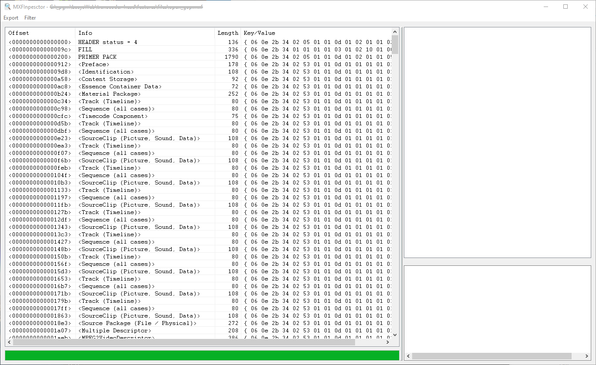
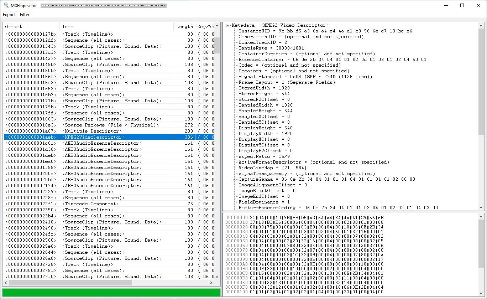
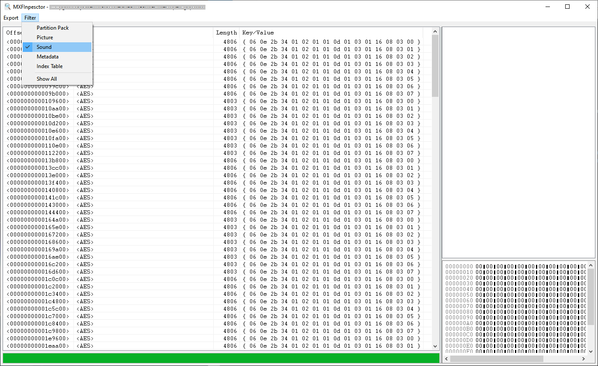

# MXF Inspector

MXFInspector is a functional and free Windows tool to display the internal structure of a MXF (Material eXchange Format) files. It can NOT play the MXF movie itself.

MXF files are extensively used in the broadcast industry. Since I was working in the broadcast company, I personally used a lot of MXF files in the past. I wanted to determine if certain MXF files were valid but could not find any good (free) tools on the internet so I decided to make my own.

## MXF Inspector Features

* Support for different MXF File Version (e.g. 1.2, 1.3)
* Support for large number of MXF metadata packs.
* View offsets, parsed MXF data and raw data in a glance.
* Physical (Offset) and Logical (Object hierarchy) view present.
* Jump to the next/previous object of the same type.
* Only show/filter the current object type.
* Written in C++/MFC. Thus allowing MXFInspector to be shipped as a single-file-application without any dependencies on installed C++ frameworks
* Large file support. It is possible to load very huge MXF files (several Gigabytes).
* Drag and drop of MXF file in order to open it

**This program is distributed in the hope that it will be useful, but WITHOUT ANY WARRANTY; without even the implied warranty of MERCHANTABILITY or FITNESS FOR A PARTICULAR PURPOSE. See the Lesser GNU General Public License for more details.**

## Screenshots

*List of KLV packets*

*KLV Packet info*

*Filter by KLV type*